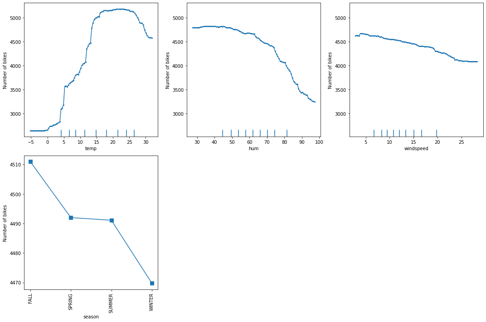
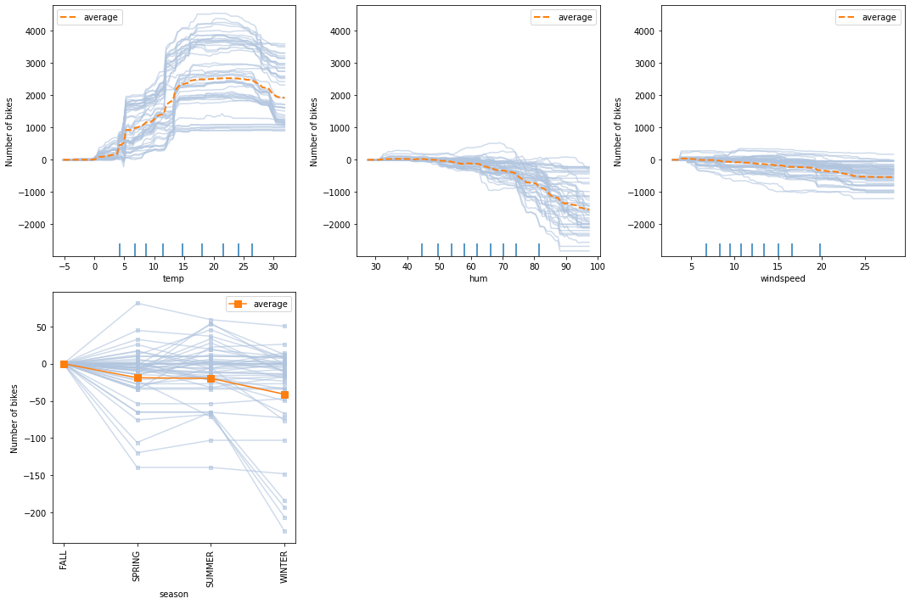
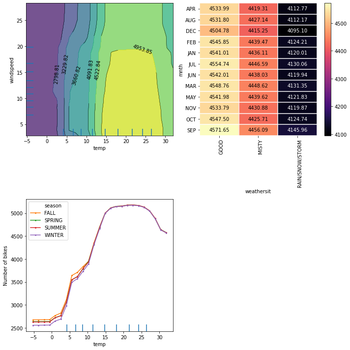

# Partial Dependence and Individual Conditional Expectation for predicting bike renting

<a id='source_1'></a>
<a id='source_2'></a>


In this example we will explain the behavior of a regression model on the [Bike rentals](http://archive.ics.uci.edu/ml/datasets/Bike+Sharing+Dataset)[[1]](#References) dataset. We will show how to calculate the partial dependence (`PD`) and the individual conditional expectation (`ICE`) to determine the feature effects on the model.

We will follow the example from the [PDP](https://christophm.github.io/interpretable-ml-book/pdp.html) chapter of the [Interpretable Machine Learning](https://christophm.github.io/interpretable-ml-book/)[[2]](#References) book and use the cleaned version of the dataset from the [github repository](https://github.com/christophM/interpretable-ml-book).


```python
import numpy as np
import pandas as pd

from sklearn.preprocessing import StandardScaler, OneHotEncoder, OrdinalEncoder
from sklearn.compose import ColumnTransformer
from sklearn.ensemble import RandomForestRegressor
from sklearn.model_selection import train_test_split

from alibi.explainers import PartialDependence, plot_pd
```

### Read and process the dataset


```python
df = pd.read_csv('https://raw.githubusercontent.com/christophM/interpretable-ml-book/master/data/bike.csv')
df.head()
```


<div>
<style scoped>
    .dataframe tbody tr th:only-of-type {
        vertical-align: middle;
    }

    .dataframe tbody tr th {
        vertical-align: top;
    }

    .dataframe thead th {
        text-align: right;
    }
</style>
<table border="1" class="dataframe">
  <thead>
    <tr style="text-align: right;">
      <th></th>
      <th>season</th>
      <th>yr</th>
      <th>mnth</th>
      <th>holiday</th>
      <th>weekday</th>
      <th>workingday</th>
      <th>weathersit</th>
      <th>temp</th>
      <th>hum</th>
      <th>windspeed</th>
      <th>cnt</th>
      <th>days_since_2011</th>
    </tr>
  </thead>
  <tbody>
    <tr>
      <th>0</th>
      <td>WINTER</td>
      <td>2011</td>
      <td>JAN</td>
      <td>NO HOLIDAY</td>
      <td>SAT</td>
      <td>NO WORKING DAY</td>
      <td>MISTY</td>
      <td>8.175849</td>
      <td>80.5833</td>
      <td>10.749882</td>
      <td>985</td>
      <td>0</td>
    </tr>
    <tr>
      <th>1</th>
      <td>WINTER</td>
      <td>2011</td>
      <td>JAN</td>
      <td>NO HOLIDAY</td>
      <td>SUN</td>
      <td>NO WORKING DAY</td>
      <td>MISTY</td>
      <td>9.083466</td>
      <td>69.6087</td>
      <td>16.652113</td>
      <td>801</td>
      <td>1</td>
    </tr>
    <tr>
      <th>2</th>
      <td>WINTER</td>
      <td>2011</td>
      <td>JAN</td>
      <td>NO HOLIDAY</td>
      <td>MON</td>
      <td>WORKING DAY</td>
      <td>GOOD</td>
      <td>1.229108</td>
      <td>43.7273</td>
      <td>16.636703</td>
      <td>1349</td>
      <td>2</td>
    </tr>
    <tr>
      <th>3</th>
      <td>WINTER</td>
      <td>2011</td>
      <td>JAN</td>
      <td>NO HOLIDAY</td>
      <td>TUE</td>
      <td>WORKING DAY</td>
      <td>GOOD</td>
      <td>1.400000</td>
      <td>59.0435</td>
      <td>10.739832</td>
      <td>1562</td>
      <td>3</td>
    </tr>
    <tr>
      <th>4</th>
      <td>WINTER</td>
      <td>2011</td>
      <td>JAN</td>
      <td>NO HOLIDAY</td>
      <td>WED</td>
      <td>WORKING DAY</td>
      <td>GOOD</td>
      <td>2.666979</td>
      <td>43.6957</td>
      <td>12.522300</td>
      <td>1600</td>
      <td>4</td>
    </tr>
  </tbody>
</table>
</div>


We will be using the `cnt` column as the target in the regression task. The `cnt` stands for the `Count of bicycles` which includes the casual and the registered users. We invite the reader to follow [this](https://christophm.github.io/interpretable-ml-book/bike-data.html) link for more details on the dataset.


```python
# extract feature names
feature_names = df.columns.tolist()
feature_names.remove('cnt')

# define target names
target_names = ['Number of bikes']

# define categorical columns
categorical_columns_names = ['season', 'yr', 'mnth', 'holiday', 'weekday', 'workingday', 'weathersit']

# define categorical and numerical indices for later preprocessing
categorical_columns_indices = [feature_names.index(cn) for cn in categorical_columns_names] 
numerical_columns_indices = [feature_names.index(fn) for fn in feature_names if fn not in categorical_columns_names]

# extract data
X = df[feature_names]
y = df['cnt']

# split data in train & test
X_train, X_test, y_train, y_test = train_test_split(X, y, test_size=0.2, random_state=0)
```

To preprocess the dataset in a format expected by the `alibi` explainers, we ordinally encode the categorical columns (i.e. string to integer) and we construct the `categorical_names` necessary to specify to the explainer which are the categorical features of the datasets. The `categorical_names` is a dictionary having as key the indices of the categorical columns and as values the corresponding feature values. For more details, see the [method description page](../methods/PartialDependence.ipynb).


```python
# define and fit the oridnal encoder
oe = OrdinalEncoder().fit(X_train[categorical_columns_names])

# transform the categorical columns to ordinal encoding
X_train.loc[:, categorical_columns_names] = oe.transform(X_train[categorical_columns_names])
X_test.loc[:, categorical_columns_names] = oe.transform(X_test[categorical_columns_names])

# convert data to numpy
X_train, y_train = X_train.to_numpy(), y_train.to_numpy()
X_test, y_test = X_test.to_numpy(), y_test.to_numpy()

# define categorical mappings
categorical_names = {i: list(v) for (i, v) in zip(categorical_columns_indices, oe.categories_)}
```

We apply standard preprocessing steps to the dataset: standardization for the numerical features and one-hot encoding for the categorical ones. Note that the one-hot encoding is the representation to be used by the classifier. We require the previous label encoding step to transform the data into the standard format used by the `alibi` explainers.


```python
# define numerical standard sclaer
num_transf = StandardScaler()

# define categorical one-hot encoder
cat_transf = OneHotEncoder(
    categories=[range(len(x)) for x in categorical_names.values()],
    handle_unknown='ignore',
)

# define preprocessor
preprocessor = ColumnTransformer(
    transformers=[
        ('cat', cat_transf, categorical_columns_indices),
        ('num', num_transf, numerical_columns_indices),
    ],
    sparse_threshold=0
)
```


```python
# fit preprocessor
preprocessor.fit(X_train)

# preprocess train and test datasets
X_train_ohe = preprocessor.transform(X_train)
X_test_ohe = preprocessor.transform(X_test)
```

### Train regressor

Now that we have the dataset in a good format, we are ready to train the model. For this example, we use a `RandomForestRegressor` from `sklearn` library.


```python
# define and fit regressor - feel free to play with the hyperparameters 
predictor = RandomForestRegressor(random_state=0)
predictor.fit(X_train_ohe, y_train)

# compute scores
print('Train score: %.2f' % (predictor.score(X_train_ohe, y_train)))
print('Test score: %.2f' % (predictor.score(X_test_ohe, y_test)))
```

    Train score: 0.98
    Test score: 0.90


### Partial dependence 

Before proceeding with the explanation, there is one additional step we need to perform. The `PartialDependece` explainer expects the categorical features to be ordinal encoding and does not have explicit support for one-hot encoding yet (to be addressed in future releases).

To address this limitation, we can simply define a prediction function which applies the preprocessing step before passing the data to the `predict` method. This can be achieved as follows:


```python
prediction_fn = lambda x: predictor.predict(preprocessor.transform(x))
```

Now that we defined the prediction function, we are ready to initialize the explainer.


```python
# define explainer
explainer = PartialDependence(predictor=prediction_fn,
                              feature_names=feature_names,
                              target_names=target_names,
                              categorical_names=categorical_names)
```

Select a few features of interest, such as *temperature*, *humidity*, *wind speed*, and *season*.


```python
# select temperature, humidity, wind speed, and season
features = [feature_names.index('temp'), 
            feature_names.index('hum'), 
            feature_names.index('windspeed'),
            feature_names.index('season')]
```

To compute the `PD` for the features listed we call the `explain` method. The parameter `kind='average'` specifies to return of the `PD` values. For some tree-based `sklearn` models, one can use the `TreePartialDependence` explainer for which the computation is faster. Note that the two methods do not agree in general on the values they return. This is because the marginal effect is computed with respect to different probability distributions. For more details on the computation method, check the `sklearn` [documentation page](https://scikit-learn.org/stable/modules/partial_dependence.html#computation-methods).

Following the `PD` computation, we can simply display the `PD` curves by calling the `plot_pd` method. The method allows the user to customize the plots as desired. For more details, see the [method description page](../methods/PartialDependence.ipynb).


```python
# compute explanations
exp = explainer.explain(X=X_train,
                        features=features,
                        kind='average')
```


```python
# plot partial dependece curves
plot_pd(exp=exp,
        n_cols=3,
        sharey='row',
        fig_kw={'figheight': 10, 'figwidth': 15});
```


    

    


We can observe that the average model prediction increases with the temperature till it reaches approximately $17^\circ C$. Then it flattens at a high number until the weather becomes too hot (i.e. approx. $27^\circ C$), after which it starts dropping again. 

The humidity larger than $60\%$ seems to be a factor that inhibits the number of rentals since we can observe a downward trend from that point onward.

A similar analysis can be conducted for the wind speed. As the wind speed increases, fewer and fewer people are riding the bike. Interestingly, as also mentioned in [here](https://christophm.github.io/interpretable-ml-book/pdp.html), the number of bike rentals flattens after $25 \text{km/h}$. By looking at the decile ticks, we can observe that there is not much data in that intervals. The model might not have learned to extrapolate correctly in that region, thus the predictions might not be meaningful.

Lastly, looking at the average prediction for each season, we can observe that all seasons show a similar effect on the model predictions, with a maximum in fall and a minimum in winter.

###  Individual conditional expectation

Although the `PD` plots can give us some insight concerning the average model response, they can also hide some heterogeneous effects. This is because the `PD` plots show the average marginal effects. To visualize the response of each data point and uncover heterogeneous effects we can use the `ICE` plots.

To compute both the `PD` and the `ICE`, we simply set the parameter `kind='both'`. Note that the `TreePartialDependece` alternative cannot compute the `ICE`.

Because the `PD` is the average of the `ICE`, the `ICE` plots can be heavily dispersed around the `PD` which can hide away the evolution of a data point as we change the feature value. Thus, it is recommended to center the plots at 0 by subtracting the value corresponding to the initial feature value. 


```python
# compute explanations
exp = explainer.explain(X=X_train,
                        features=features,
                        kind='both')
```


```python
# random seed for `ice` sampling
np.random.seed(13) 

# plot the pd and ice
plot_pd(exp=exp,
        n_cols=3,
        n_ice=50,   # number of ICE curves to be displayed. Can be set to 'all' or provided a list of indices
        sharey='row',
        center=True,  # center the plots for better visualization
        fig_kw={'figheight': 10, 'figwidth': 15});
```


    

    


For example, we can observe that there exist some particular scenarios in which the bike rental increases significantly and stays constant as the wind speed increases between $5$ and $22 \text{km/h}$. Similarly, in some scenarios, the bike rental may stay the almost the same for winter relative to the other seasons. Such effects were hidden from us in the `PD` plot.

### Partial dependence for two features

We will continue to provide some examples and a brief analysis of two feature `PD` plots, including a combination of two numerical features, two categorical features, and one numerical & one categorical. As we will see, 2-way `PD` plots helps us understand and visualize feature intereactions.


```python
features = [
    (feature_names.index('temp'), feature_names.index('windspeed')),
    (feature_names.index('mnth'), feature_names.index('weathersit')),
    (feature_names.index('season'), feature_names.index('temp'))    
]
```


```python
# compute explanations
exp = explainer.explain(X=X_train,
                        features=features,
                        kind='average',
                        grid_resolution=25)
```


```python
# plot partial dependece curves
plot_pd(exp=exp,
        n_cols=2,
        fig_kw={'figheight': 10, 'figwidth': 10});
```


    

    


From the interaction plot between the temperature and wind speed, we can observe that between $-5$ and about $12^\circ C$, the wind speed does not influence the average prediction that much. This can be deduced from the vertical strips of similar values restricted to the feature values domain of the reference dataset. The global trend is such that no matter the wind speed, the number of rented bikes increases with the temperature. As the temperature increases over $12^\circ C$ and stays below $30^\circ C$, we can observe that the wind speed starts to become more relevant for the model's prediction. We note that the number of rented bikes stays high until the wind speed surpasses the value of approximately $18 \text{km/h}$, after which it starts dropping. This suggests that for relatively warm weather, the number of rentals increases as long as the wind is not too rough. Finally, we can observe that for extremely hot weather, the number of rentals drops again with the temperature.

By inspecting the weather situation against the month, interestingly, we can observe the rental prediction is influenced by the weather situation and not by the calendar month. As the weather deteriorates, the rentals drop, independent of the calendar month.

A similar situation can be observed in the plot of temperature against the season. Something that we've seen before is that the number of predicted rentals seems to be independent of the season and only depends on the temperature outside. As we have mentioned before, as the temperature increases, the number of rentals seems to increase till it reaches $17^\circ C$. Then it flattens at a high number until the weather becomes too hot (i.e. approx. $27^\circ C$), after which it starts dropping again. 

## References

<a id='References'></a>

[[1]](#source_2) Fanaee-T, Hadi, and Gama, Joao, 'Event labeling combining ensemble detectors and background knowledge', Progress in Artificial Intelligence (2013): pp. 1-15, Springer Berlin Heidelberg.

[[2]](#source_1) Molnar, Christoph. Interpretable machine learning. Lulu. com, 2020.
